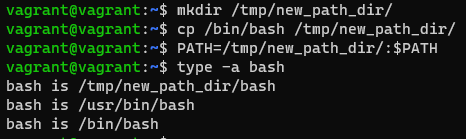

# Домашнее задание к занятию "3.1. Работа в терминале, лекция 1"

1. Установите средство виртуализации [Oracle VirtualBox](https://www.virtualbox.org/).
-- done
2. Установите средство автоматизации [Hashicorp Vagrant](https://www.vagrantup.com/).
-- done
3. В вашем основном окружении подготовьте удобный для дальнейшей работы терминал. Можно предложить:

	* iTerm2 в Mac OS X
	* Windows Terminal в Windows <<<< chose this one
	* выбрать цветовую схему, размер окна, шрифтов и т.д.
	* почитать о кастомизации PS1/применить при желании.

-- done

4. С помощью базового файла конфигурации запустите Ubuntu 20.04 в VirtualBox посредством Vagrant:

	* Создайте директорию, в которой будут храниться конфигурационные файлы Vagrant. В ней выполните `vagrant init`. Замените содержимое Vagrantfile по умолчанию следующим:

		```bash
		Vagrant.configure("2") do |config|
			config.vm.box = "bento/ubuntu-20.04"
		end
		```
-- done
	* Выполнение в этой директории `vagrant up` установит провайдер VirtualBox для Vagrant, скачает необходимый образ и запустит виртуальную машину.
-- done
	* `vagrant suspend` выключит виртуальную машину с сохранением ее состояния (т.е., при следующем `vagrant up` будут запущены все процессы внутри, которые работали на момент вызова suspend), `vagrant halt` выключит виртуальную машину штатным образом.
-- done
5. Ознакомьтесь с графическим интерфейсом VirtualBox, посмотрите как выглядит виртуальная машина, которую создал для вас Vagrant, какие аппаратные ресурсы ей выделены. Какие ресурсы выделены по-умолчанию?
1024 Mb RAM, 2 CPU, 4 Mb Video Memory, 64 Gb HDD

6. Ознакомьтесь с возможностями конфигурации VirtualBox через Vagrantfile: [документация](https://www.vagrantup.com/docs/providers/virtualbox/configuration.html). Как добавить оперативной памяти или ресурсов процессора виртуальной машине?
-- с помощью параметров  v.memory и v.cpus в конфиге Vagrantfile

7. Команда `vagrant ssh` из директории, в которой содержится Vagrantfile, позволит вам оказаться внутри виртуальной машины без каких-либо дополнительных настроек. Попрактикуйтесь в выполнении обсуждаемых команд в терминале Ubuntu.
-- done SSH, sudo apt-get update && apt-get upgrade, navigation and creating files & directories, etc.

8. Ознакомиться с разделами `man bash`, почитать о настройках самого bash:
    * какой переменной можно задать длину журнала `history`, и на какой строчке manual это описывается?
-- HISTSIZE, строчка 862 (значение по умолчанию: 500)
	
    * что делает директива `ignoreboth` в bash?
-- игнорирует (не сохраняет в историю) команды, начинающиеся с пробела и команды (ignorespace), и команды совпадающие с последней выполненной командой (ignoredups)

9. В каких сценариях использования применимы скобки `{}` и на какой строчке `man bash` это описано?
-- фигурные скобки `{}` или Brace expansion (строчка 1127) - одни из семи сокращений bash, которое позволяет объединить и сократить ввод команд (например, при создании нескольких директорий можно ввести только одну команду mkdir {01..05}, чтобы создать 5 директорий с именами 01, 02, 03, 04 и 05) 

10. Основываясь на предыдущем вопросе, как создать однократным вызовом `touch` 100000 файлов? А получилось ли создать 300000? Если нет, то почему?
-- touch {1..100000}
-- создать 300000 не удастся, ошибка -bash: /usr/bin/touch: Argument list too long, т.е. слишком большое количество аргументов (в данном случае, файлов для создания)

11. В man bash поищите по `/\[\[`. Что делает конструкция `[[ -d /tmp ]]`
-- проверяет условие наличие директории /tmp у -d

12. Основываясь на знаниях о просмотре текущих (например, PATH) и установке новых переменных; командах, которые мы рассматривали, добейтесь в выводе type -a bash в виртуальной машине наличия первым пунктом в списке:

	```bash
	bash is /tmp/new_path_directory/bash
	bash is /usr/local/bin/bash
	bash is /bin/bash
	```

	(прочие строки могут отличаться содержимым и порядком)
    В качестве ответа приведите команды, которые позволили вам добиться указанного вывода или соответствующие скриншоты.
    


13. Чем отличается планирование команд с помощью `batch` и `at`?
-- at запускает команду в определённое время
-- batch (или alias к at -b) запускает команду при системной нагрузке, ниже определённой (по умолчанию 1.5)

14. Завершите работу виртуальной машины чтобы не расходовать ресурсы компьютера и/или батарею ноутбука.
-- done: vagrant suspend
